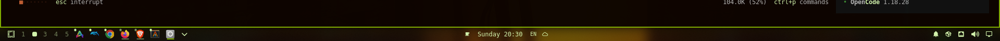

# Simple Task Bar

A Plasma-style task bar for Omarchy (Hyprland). Shows running and pinned app
icons in the bar and minimizes or restores windows to a dedicated scratchpad on
click.



## Features

- **Click to focus/minimize/restore** – unfocused window → focus; focused →
  send to scratchpad; minimized → restore to the current workspace.
- **Pin apps** – right-click any running app and choose "Pin to taskbar" to
  keep it in the bar. Pins persist across sessions.
- **Unpin apps** – right-click a pinned icon and choose "Remove from taskbar".
- **App icons** – resolved from installed desktop entries; a pinned indicator
  dot shows which items are pinned.
- **Grouping** – multiple windows of the same app share one task bar entry.
- **Scratchpad** – minimized windows live in `special:omarchy-taskbar` and are
  restored to whichever workspace was focused when you clicked.

## Install

From the marketplace, copy the install command shown on the plugin page, or add
it directly from the repository:

```sh
omarchy plugin add <repository-url> --enable
omarchy restart shell
```


The widget is a `bar-widget` placed in the bar's default section. If it does
not appear after enabling, run `omarchy plugin list` to confirm it is enabled,
then `omarchy restart shell`.

## Remove

```sh
omarchy plugin remove io.github.librael-the-culprit.simple-task-bar
```

Removal disables the plugin first, then deletes the checkout. The upstream
repository is unaffected.

## State

Pinned apps are stored in
`~/.local/state/omarchy/taskbar/pinned`. Deleting the file removes all pins.

## Compatibility

Built and tested on Omarchy Quattro. No external dependencies beyond a working
Hyprland and the omarchy shell.

## License

MIT. See [LICENSE](LICENSE).
